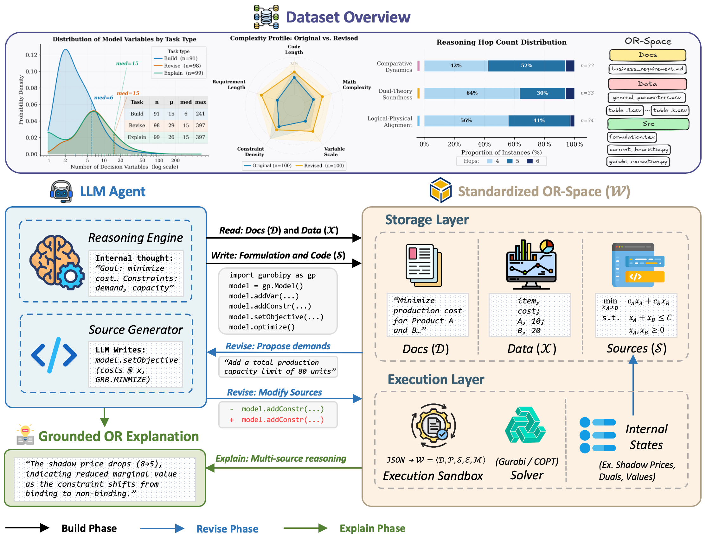

<p align="center">
  
</p>

# OR-Space

**A full-lifecycle workspace benchmark for industrial optimization agents.**

[](https://huggingface.co/datasets/Chenyu-Zhou/OR-Space)
[](https://creativecommons.org/licenses/by-nc/4.0/)
[](#benchmark)

OR-Space evaluates whether language-model agents can perform reliable operations
research work inside executable, multi-file workspaces. Each instance separates
business requirements, structured parameter files, code artifacts, solver state,
and evaluation targets instead of flattening the optimization problem into one
prompt.

<p align="center">
  
</p>

## Links

| Resource | Location |
| --- | --- |
| Dataset | [huggingface.co/datasets/Chenyu-Zhou/OR-Space](https://huggingface.co/datasets/Chenyu-Zhou/OR-Space) |
| Code repository | [github.com/0xzhouchenyu/OR-Space](https://github.com/0xzhouchenyu/OR-Space) |
| Paper | arXiv link coming with the public manuscript release |

## Benchmark

OR-Space contains 100 industrial optimization topologies, each rendered as three
task views on the same underlying mathematical problem:

| Task | What the agent receives | What is evaluated |
| --- | --- | --- |
| Build | Business documents, tabular data, and an empty `src/` scaffold | Whether the agent can write solver-ready code from heterogeneous files |
| Revise | Original workspace, revised requirements, updated data, and legacy heuristic code | Whether the agent can preserve valid logic while implementing changed requirements |
| Explain | Original and revised workspaces plus recorded solver artifacts | Whether the agent can ground an explanation in code, data, solver state, and OR theory |

Build and Revise are scored by executing the submitted solver program and
matching the reference objective value within 1% relative error. Explain is
scored with exact-match checklist items plus rubric-based judgments for
reasoning, grounding, answer quality, and hallucination control.

The default paper track uses the filesystem interface, Revise-code context,
and Gurobi. Build and Revise submissions are complete solver-specific programs;
each backend track uses its corresponding API rather than a shared PuLP model
with a backend mounted by the evaluator.

## Quick Start

Download the release from Hugging Face:

```bash
pip install -U huggingface_hub pandas
python - <<'PY'
from huggingface_hub import snapshot_download

snapshot_download(
    repo_id="Chenyu-Zhou/OR-Space",
    repo_type="dataset",
    local_dir="OR-Space",
)
PY
unzip -q OR-Space/build-revise-explain_workspaces.zip -d OR-Space
```

Inspect the task index:

```bash
python - <<'PY'
import pandas as pd

index = pd.read_csv("OR-Space/metadata/workspace_index.csv")
print(index.groupby("task_type").size())
print(index.head()[["workspace_id", "task_type", "workspace_path"]])
PY
```

The expanded workspaces follow this pattern:

```text
build-revise-explain_workspaces/
  build_workspaces/instance_1/
    docs/
    data/
    src/
    metadata.json
  revise_workspaces/instance_1/
    original/
    revised/
    metadata.json
  explain_workspaces/instance_1/
    original/
    revised/
    solver_artifacts/
    metadata.json
```

## What This Repo Contains

The public GitHub repository is the project and supplementary-code companion.
The full dataset package is published through the Hugging Face dataset
repository.

```text
.
  README.md
  LICENSE
  figs/                     Project-page figures
  01_build/                 Build workspace generation utilities
  02_revise_modeling/       Revise workspace generation utilities
  03_revise_business/       Business-voice rewriting utilities
  04_difficulty_judge/      Difficulty judging utilities
  05_business_quality_rubric/
  06_static_diff/           Static revision-diff analysis
  evaluation/               Executable Build/Revise and Explain scoring
  results/                  Machine-readable paper table snapshots
  tools/                    Participant staging and release validation
  tests/                    Evaluator smoke tests
```

The Hugging Face repository contains the 300 participant-visible task views,
Build/Revise objective references, all 100 Explain rubrics/checklists, and the
same evaluation protocol. Participant workspaces and evaluator-only labels are
kept in separate paths so models are not accidentally given reference code or
answers.

## Evaluation

See [`evaluation/`](evaluation/) for runnable scorers. In particular,
[`evaluation/explain/`](evaluation/explain/) documents the complete Explain
workflow: deterministic normalized entity checks, criterion-level semantic
judgments, verified workspace evidence, the independent judge prompt and JSON
schema, and aggregation into the paper's 35/35/20/10 rubric with an unsupported-
claim penalty of up to 12 points.

The current 18-model Table 2 snapshot is published in
[`results/table2_main_results.csv`](results/table2_main_results.csv). Its
Revise-code/Gurobi column is also available separately in
[`results/gurobi/revise_code.csv`](results/gurobi/revise_code.csv); release
validation checks that the two remain identical.

## Main Paper Findings

| Finding | Result |
| --- | --- |
| Workspace construction remains hard | The best Build score is 72.0% Pass@1 |
| Revision context is model-dependent | Legacy heuristic code helps strong models but hurts weaker models |
| Explanation is a distinct capability | Explain scores are weakly correlated with Build and Revise success |

These results should be interpreted as benchmark evidence about synthetic,
executable OR workspaces, not as a deployment certificate for production
optimization systems.

## Release Policy

For reproducibility, cite a Hugging Face Hub tag or commit SHA rather than a
moving `main` branch. Planned public tags are:

- `neurips2026-submission`: paper submission snapshot
- `v1.0`: first public archival release

## Citation

```bibtex
@misc{zhou2026orspace,
  title = {OR-Space: A Full-Lifecycle Workspace Benchmark for Industrial Optimization Agents},
  author = {Zhou, Chenyu and Lu, Xinyun and Zhao, Jiangyue and Lin, Jianghao and Ge, Dongdong and Ye, Yinyu},
  year = {2026},
  note = {Dataset: https://huggingface.co/datasets/Chenyu-Zhou/OR-Space}
}
```

## License

The dataset release is for non-commercial research use under CC BY-NC
4.0-compatible terms, following the inherited license constraints of the
IndustryOR seed topologies. Proprietary solver binaries, commercial API
credentials, and third-party model services are not redistributed.
